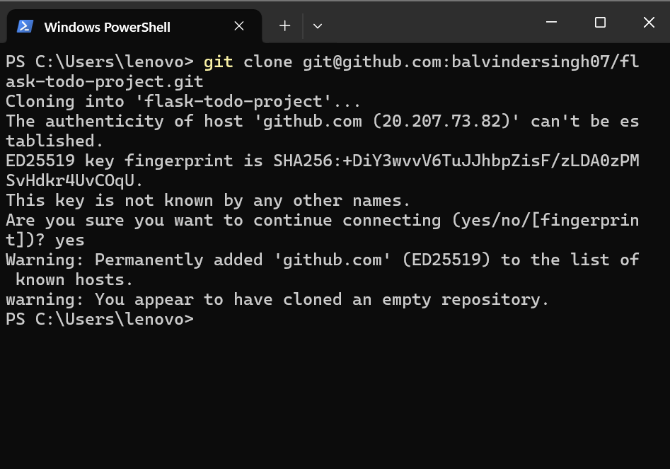
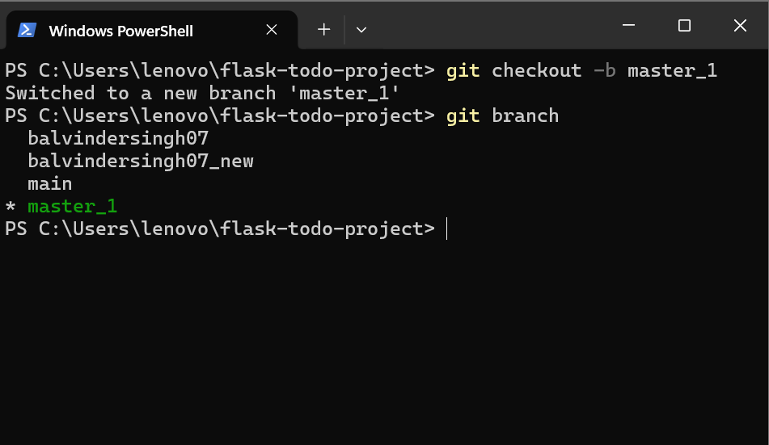
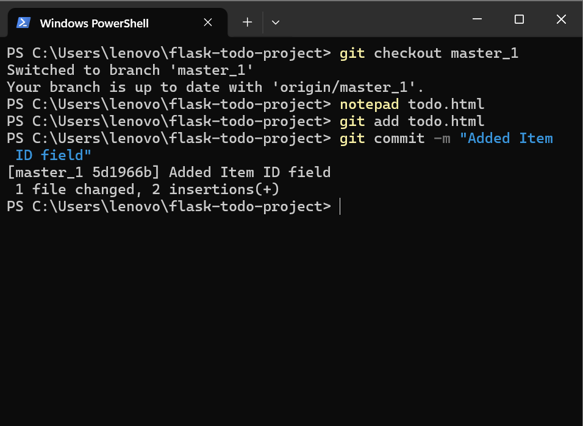
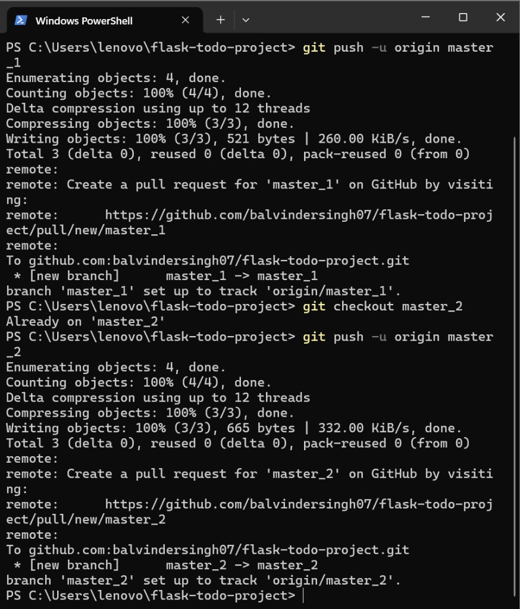
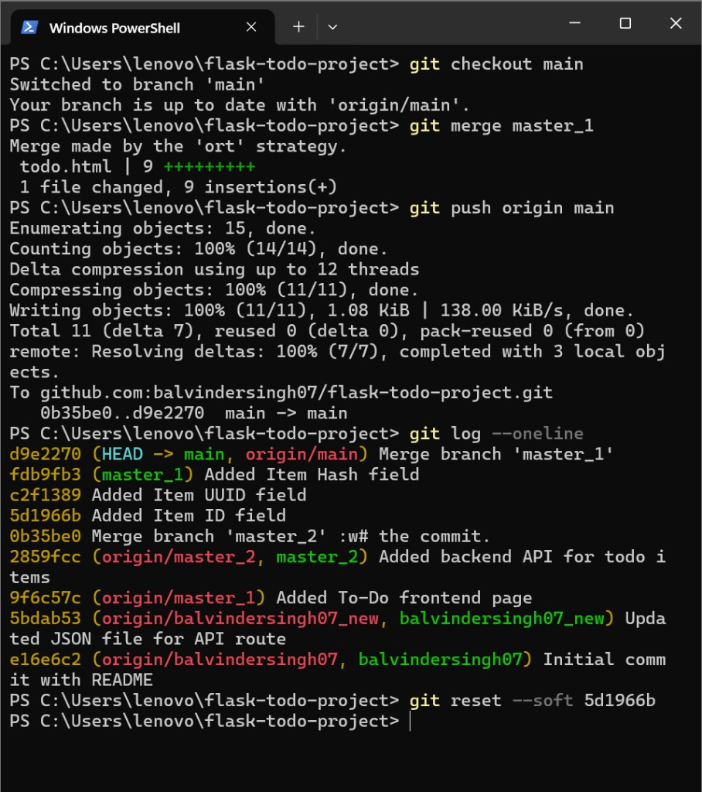
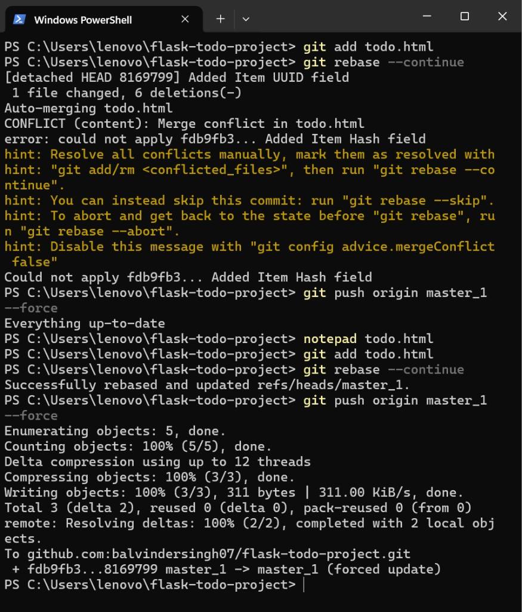

# Flask Todo Project - Git Workflow Evidence Report

## Executive Summary

This report documents the Git and GitHub workflow followed while setting up and iterating on the Flask Todo project. The screenshots capture branch creation, commits, rebasing, conflict handling, and remote pushes to GitHub.

Repository: [balvindersingh07/flask-todo-project](https://github.com/balvindersingh07/flask-todo-project)

## Workflow Timeline and Evidence

### 1) Repository clone and SSH trust prompt

The repository was cloned over SSH, and the GitHub host key was accepted.

### 2) Branch setup for feature work (`master_1`)

Feature branch `master_1` was created and verified via `git branch`.

### 3) Incremental commit creation on `master_1`

Focused commits were created while evolving `todo.html` (for example: adding Item ID field).

### 4) Pushes to remote branches on GitHub

Branch pushes were successful, and GitHub confirmed tracking branches and PR URLs.

### 5) Merge and publish from `main`

Work from feature branches was merged into `main` and then pushed upstream.

### 6) Rebase conflict encountered and resolved safely

A rebase conflict occurred in `todo.html`, then the workflow resumed with `git add`, `git rebase --continue`, and a final force push after rebase completion.

## Key Observations

- Branch-based development was used consistently (`main`, `master_1`, `master_2`, and supporting branches).
- Commits were created incrementally rather than as a single large change.
- Remote tracking was set correctly using `git push -u`.
- A non-trivial rebase conflict was resolved without discarding work.
- Merge and push activity confirms the project history reached GitHub.

## Current Project Artifacts

Core files present in the repository include:

- `app.py` (Flask backend API logic)
- `todo.html` (frontend UI)
- `data.json` (stored todo data)
- `README.md` (project overview)
- `screenshots/` (full screenshot evidence set)
- `PROJECT_REPORT.md` (this report)

